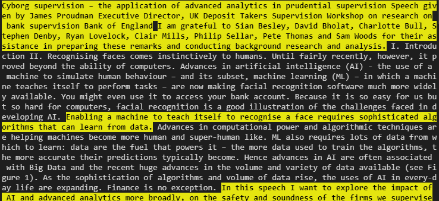

# speech-nlp
Summarise speeches contained in .pdf documents.

## Package contents
- `summary.io` Import / export utilities for pdf file conversion
- `summary.preprocess` Data cleaning utilies
- `sumamry.model` Modelling classes

## Notebooks
- `make_slides.ipynb` Notebook for generating presentation. Includes examples of :
  - Data cleaning
  - Feature extraction
  - Topic modelling (including hyperparameter optimisation)
  - `TextRank` summarisation & keyword ranking
- `summariser.ipynb` Text summary using `bert-extractive-summarizer`

## Example Input
See the [data](/data) directory for example input data:
- `*.pdf` - raw pdf documents
- `*.txt`- extracted text
- `all_data.csv` - extracted text consolidated into csv format

## Example Output
See the [output](/output) directory for example output:
- `BERT_summaryXX.txt` - summarised documents using `bert-extractive-summarizer`
- `ranked_summaryXX.txt` - summarised documents using `TextRank`
- `entitiesXX.csv` - table of extracted entities (organisations / people)
- `token_frequency.csv` - table of token frequency for each document

